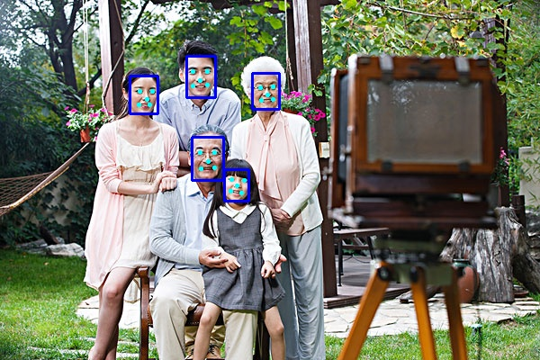

### A MTCNN test demo in caffe(c++ version)

- mainly refer to https://github.com/DaFuCoding/MTCNN_Caffe

- further (train code) improve will be continued

### 检测结果

注：

- 该工程在windows-caffe下添加的， 具体配置可以参考官方caffe 例子 classification项目
  配置例子 https://blog.csdn.net/bjailihong/article/details/77540602

- 项目会添加一些新layer， 见https://github.com/DaFuCoding/MTCNN_Caffe